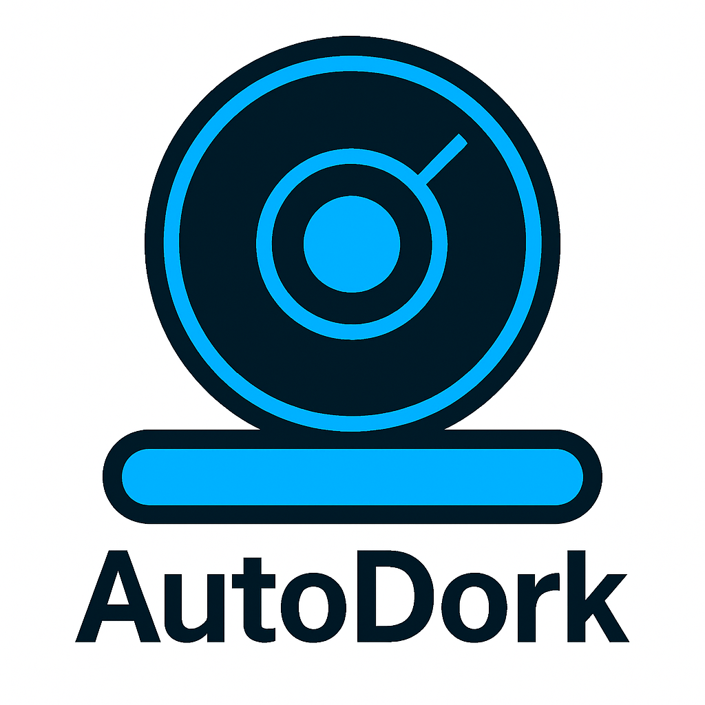

# AutoDork




AutoDork is a flexible, production-ready automated Google dorking suite for OSINT username hunting, public data discovery, and threat reconnaissance. Give it a username, email, or keyword and it’ll hammer through modular Google dork scripts, logging every result with easy tagging, review, and reporting.

---

## Features

- **Modular:** Easily add, edit, or manage dork scripts and configs – no code changes needed.
- **Rich CLI:** Interactive, colorized output with tables and fuzzy script selection.
- **Bulk & Automation:** Wordlist/bulk modes, profiles, schedule scripts, and full non-interactive automation.
- **Exports:** Direct one-click export to Obsidian, Evernote, Notion markdown, CSV, JSON, and HTML.
- **Review & Tag:** Interactive URL tagging for fast triage and workflow.
- **Backups:** Full backup/restore for all dorks and config files.
- **Error Logging:** All failures & exceptions logged for troubleshooting.
- **Extensible:** Add dorks, helpers, outputs, or entire new modules without touching main.py.
- **Wizard:** Interactive script generator for making new dork modules in seconds.

---

## Usage

1. **Install dependencies:**  

   ```bash
   pip install -r requirements.txt

    Configure settings:
    Edit config/settings.yaml to add dorks, set result count, blacklist domains, or choose default output formats.

    Run interactively:

    python3 main.py

    Or automate with CLI args (see Usage Guide for all options).

    Results:

        All results/logs go to /results/, /logs/, and (optionally) /exports/.

        Tag, export, or review directly via CLI prompts.

## Quick Examples

Username hunt (interactive):

```python
    python3 main.py --tag-bulk username_dork_jdoe_1718608956
    ```

Documentation

    Full Usage Guide →
    Every command, helper module, and export format is documented in detail.

Roadmap

    Proxy & random User-Agent support

    API key integration (SerpAPI, Bing, etc.)

    Site-specific scraping & bypass

    Advanced workflow automation (chains, hooks)

    Web dashboard (future)

Disclaimer

Use AutoDork responsibly. Respect privacy, legal boundaries, and terms of service.
